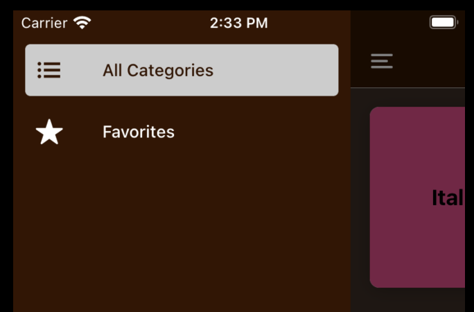
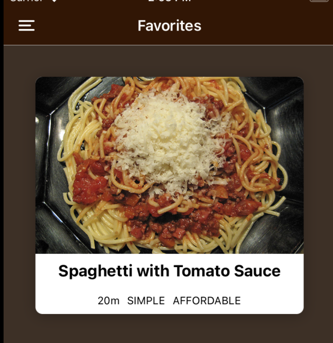
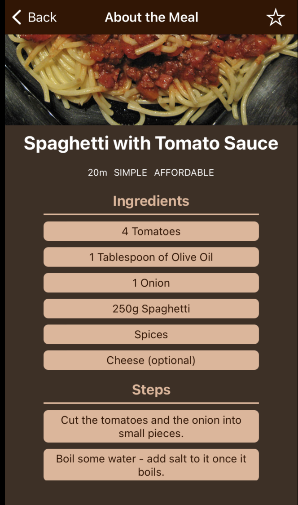

## main page

## use React Navigation to change to favoritePage

### inside of each category has some meals

### click to look through meal detail

### click the star which is at upper right corner to add this meal to your favorite list.